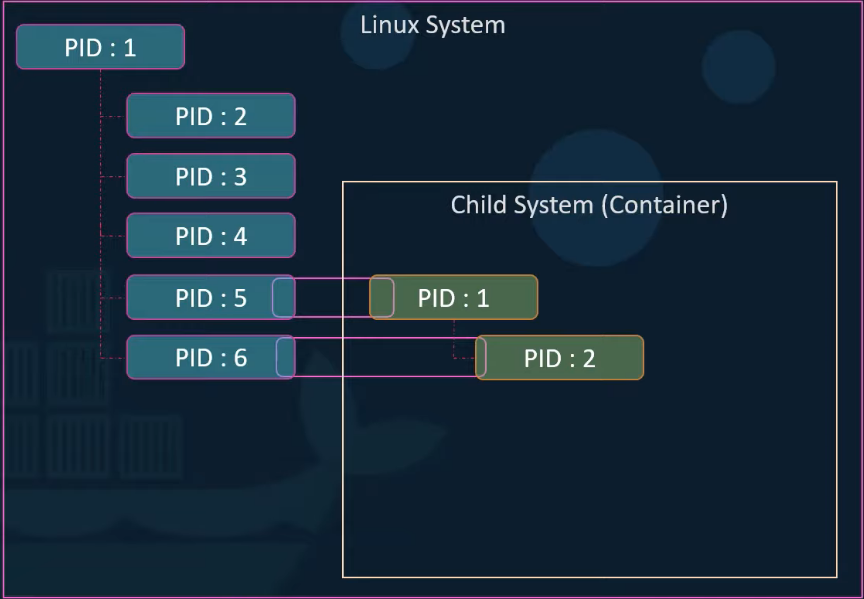
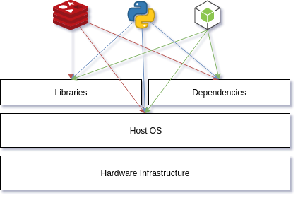
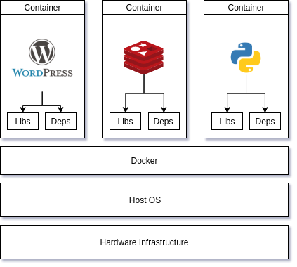
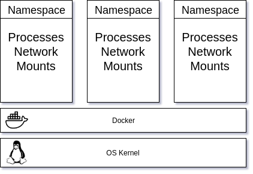
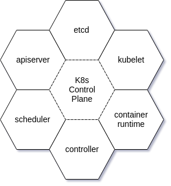
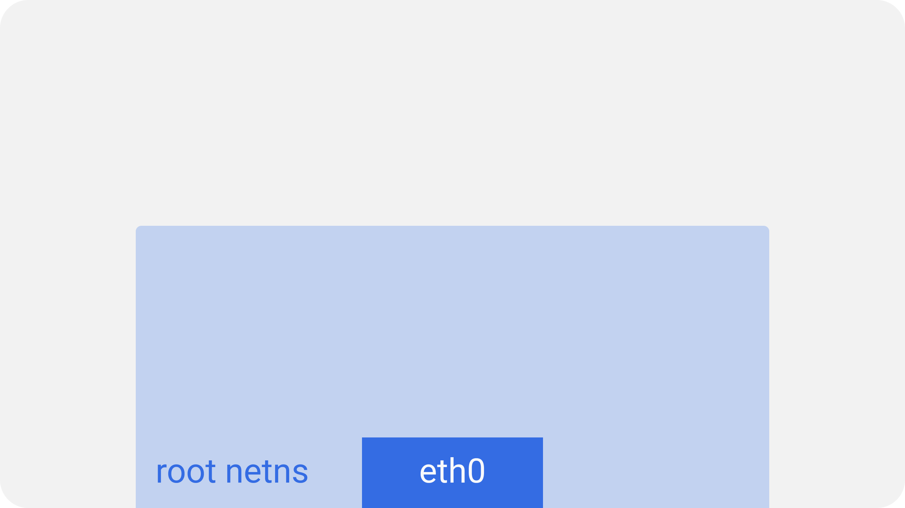
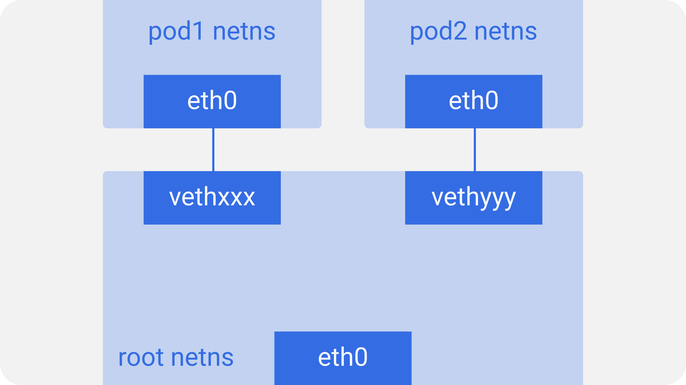
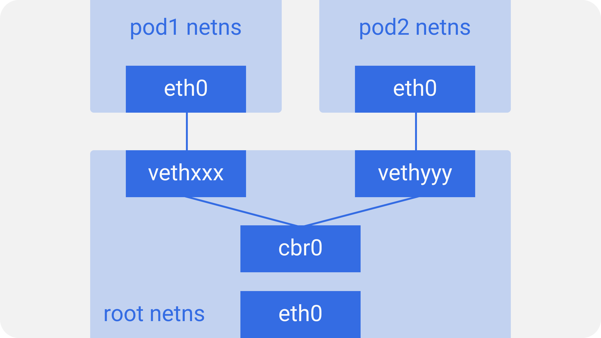
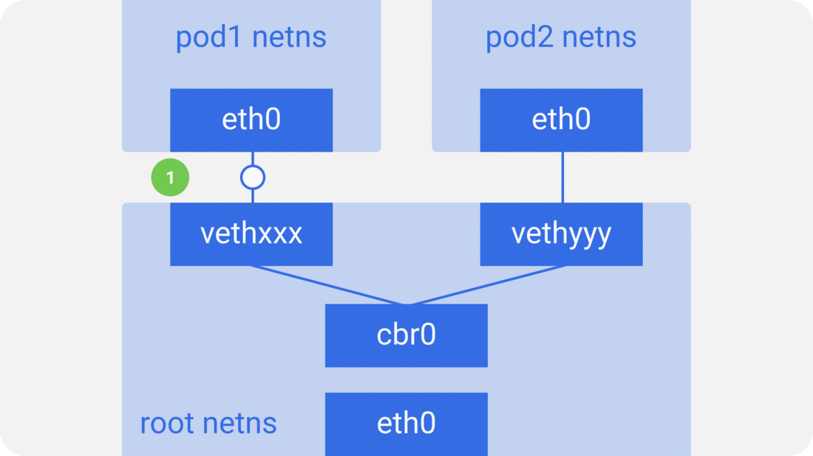
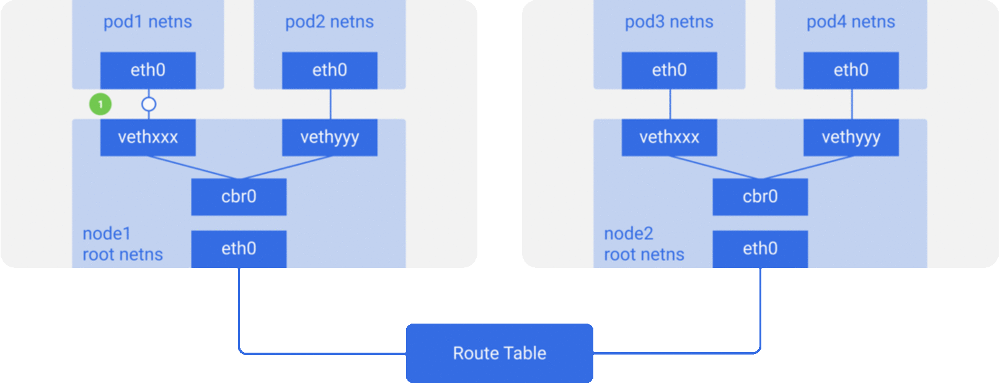

#

## Introduction to Docker and Kubernetes

---

## This talk is for

- People who don't know `docker`, `k8s` and how its work?
- Who curious enough to learn more about the implementations
- Best pratices & use cases

---

## Story of Docker

**Docker** is actually a product of the **Namespace** from **Linux Kernel**.

--

### So why docker?

At the dawn of computers, people deploy their code through a `process`, and that `process` is running on the **Host OS**. As time goes by, the process is going to break the **Host OS**, and the computer needs a restart.

--

### Story of Virtual Machine

Later, a great thinker thought that why don't we put a computer into another computer. So they won't crash the **Host OS** anymore. However, creating an abstraction layer is too much overhead for a computer, a lot of layers are duplicated.

--

So `Docker` was founded as a container to run `Processes` without creating a lot of overheads and abstractions.


---

## Namespace?

> What is it? And how does docker implement this?

--

**Namespaces** are a feature of the Linux kernel that partitions kernel resources such that one set of processes sees one set of resources while another set of processes sees a different set of resources. Commons are: _mnt_, _pid_, _net_, _ipc_, _UTS_, _userid_, _cgroup_. **Namespace** are isolated environments.

--

### Example Process Namespace

```bash
# Taking from the Host OS
$ ps -aux
USER       PID %CPU %MEM    VSZ   RSS TTY      STAT START   TIME COMMAND
anhdle14   638  0.0  0.0  31264  7440 pts/0    Ss+  Aug23   0:01 -zsh
anhdle14  2612  0.0  0.0  29464  5212 pts/3    Ss   Aug23   0:00 -zsh

# Taking from the Docker archlinux image
$ docker run -it ubuntu bash
$ ps -aux
USER       PID %CPU %MEM    VSZ   RSS TTY      STAT START   TIME COMMAND
root         1  4.6  0.0  18504  3180 pts/0    Ss   07:21   0:00 bash
root        10  0.0  0.0  34396  2912 pts/0    R+   07:21   0:00 ps -aux
```

--



---

### Example Network Namespace

```bash
# Create Network
ip netns add red
ip netns add blue

# Exec in network NS
ip link
ip netns exec red ip link
```

--

### Connect Network

```bash
ip link add v-red type veth peer name v-blue
ip link set v-red netns red
ip link set v-blue netns blue
ip netns exec red ifconfig v-red 192.168.15.1/24 up
ip netns exec blue ifconfig v-blue 192.168.15.2/24 up
ip netns exec red ip link set v-red up
ip netns exec blue ip link set v-blue up
ip netns exec red ping -c 4 192.168.15.2
```

--

### Docker Networking

3 types of networks:

- **bridge** - `docker run --network=bridge`
- **none** - `docker run --network=none`
- **host** - `docker run --network=host`

--

### Clean Up

```bash
ip netns delete red
ip netns delete blue
```

--

### Advance

> Can create a linux bridge that route traffic between multiple network namespaces.

```bash
ip link add v-net-0 type bridge && ip link set dev v-net-0 up
ip -n red link del v-red && ip link add v-red type veth peer name v-red-br
ip link set v-red netns red && ip link set v-red-br master v-net-0
ip -n red addr add 192.168.15.1/24 dev v-red
ip -n red link set v-red up
ip addr add 192.168.15.5/24 dev v-net-0
```

---

## What is Docker?

> Docker is an open platform for developers and sysadmins to build, ship, and run distributed applications.

--

### Benefits of Docker

- Setup development environments in minutes.
- Deploy easily to cloud or on-premises.

```bash
docker run -it ubuntu bash
```

--

### Why do you absolutely need Docker?

<span class="fragment"></span>
<span class="fragment"></span>

--

### Docker Container?

What is an container?

> A container is an OS kernel with networking abilities, mounts, processes.

<span class="fragment"></span>

--

### Myths

- Actually you cannot run Windows container on Linux container. **In order for Docker to run, they have to share the same underlying kernel**.
  - Windows only able to run Linux container because Windows use a Linux VM to run the Linux container.

--

### Container vs VM

| | Containers | Virtual machines |
|---|---|---|
| Utilization | Low | High |
| Size | MB | GB | 
| Boot Up | Slow | Fast |

> However it is not only VM or only Docker situation.

--

### Container & Image

<span class="fragment">**Image** is a template contains multiple **layers** of instructions.</span>

<span class="fragment">**Container** is an environment to run a single **image**.</span>

<span class="fragment">
`docker run -it --rm ubuntu bash`
</span>

--

### Demo

---

## Docker-compose


<section data-background-image="https://github.com/dockersamples/example-voting-app/raw/master/architecture.png" data-background-size="40%">
</section>

---

## What is Container Orchestration?

- Container failed?
- Docker host overload?
- Docker daemon failed to respond?

<span class="fragment">-> Need a watcher to automatically deploy, scale, and manage containers.</span>

--

## Solutions

| | Features | Difficulty |
|---|---|---|
| docker-swarm | moderate | easy |
| kubernetes | full | difficult |
| mesos | full | difficult |

---

## Kubernetes

K(ubernete)s - K8s, 8 letters between `k` and `s`.

> K8s is an open-source system for automating deployment, scaling, and management of containerized applications.

--

### K8s is a cluster

A **cluster** is a set of **nodes**. If a node failed you can still connect to the process in other nodes. In order to manage these nodes, come a **master**. The **master** comes with the **control plane**

--

### K8s Control Plane

<span class="fragment"><span>

--

### K8s Control Plane Components

- etcd - Consistent and highly-available key value store
- apiserver - Front-end for the Kubernetes control plane (RESTAPI, CRUD)
- scheduler -  watches newly created pods that have no node assigned, and selects a node for them to run on

--

- controller - Brain of K8s, manage pods
- container-runtime - Software that is responsible for running containers (e.g. Docker)
- kubelet - Agent that runs on each node in the cluster. It makes sure that containers are running in a pod.

--

### Objects - Pod

K8s does not run container _directly_. Instead they are wrapped under **pod** . The atomic level of k8s is a **pod** . A **pod** is a thin wrapper around one or more containers.

- Contains one or more containers.
- Atomic unit of scheduling.
- Object on the cluster.
- Define in the v1 API group.

--

### Objects - Deployment

And **pod** in turn are wrapped in a **deployment** object. Details how to roll out (or roll back) across versions of your application.

- Object on the cluster.
- Defined in the apps/v1 API group.
- Scaling.
- Rolling updates.

---

## K8s Networking

At it's core, K8s has one important design philosophy

> Every Pod has a unique IP.

--

### Intra-node communication



--

### Intra-node communication



--

### Intra-node communication



--

### Intra-node communication



--

### Inter-node communication



--

### Services Object & Types

Although we can communicate by associate with the `IP` of each **pod** . So when the **pod are going away** the `IP` associated with the **pod is also going away**. So in order to keep the communication between **deployment** groups, k8s required a **service**.

> **Service** is a _stable network connection_

--

### Services Object

- Each **service** has a _name_ and an _ip_. And these are stable, k8s guarantee that they
will not change.
- **Service** registered with _CoreDNS_. Each service create an endpoints objects that was
synchronize with the **Label Selector**.
- **Service** has many types: **ClusterIP**, **NodePort**, **LoadBalancer**.

---

## Q&A

---

## References

https://itnext.io/an-illustrated-guide-to-kubernetes-networking-part-1-d1ede3322727
https://itnext.io/an-illustrated-guide-to-kubernetes-networking-part-2-13fdc6c4e24c
https://itnext.io/an-illustrated-guide-to-kubernetes-networking-part-3-f35957784c8e
https://github.com/burrsutter/9stepsawesome
https://github.com/dockersamples/example-voting-app
https://www.youtube.com/channel/UCSWj8mqQCcrcBlXPi4ThRDQ

---
